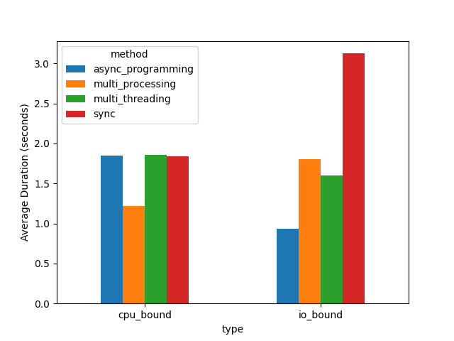

## 개요

해당 프로젝트는 IO_Bound 프로세스와 CPU_Bound 프로세스에서 병렬 프로그래밍 간의 성능 차이를 비교하는 것을 목적으로 합니다. 실험에서는 다음과 같은 방식들을 고려한다.

- sync
- async
- multi-processing
- multi-threading

## 조건

- Python 3.11
- CPU Clock: 2592GHZ
- CPU Core(Hyper Thread): 16
- Multi-Thread worker: 3
- Multi-Process worker: 3
- io bound의 경우 https://httpbin.org/get url로 요청
- cpu bound의 경우 제곱을 해서 더하는 복잡한 연산을 수행

## 실험 결과



- CPU Bound의 경우, 동기(sync), 비동기(async), 멀티 스레딩 방식은 큰 효과가 없었습니다. 멀티 스레딩이 큰 효과를 못 본 이유는 아마도 Python의 GIL 때문이라 추측된다. 멀티 프로세싱의 경우가 가장 빨랐다.
- IO Bound의 경우, 비동기(async)가 가장 큰 성능 향상을 보였다. 멀티 프로세싱과 멀티 코어에서도 성능 향상을 보였고, 단순 동기(sync) 방식이 가장 시간이 많이 걸렸다.

## 실행 방법

파이썬 디렉토리에서 실행합니다
<br></br>

로그 데이터 시각화

```shell
python analyze.py
```

테스트하기

```shell
python main.py
python async_main.py
```
